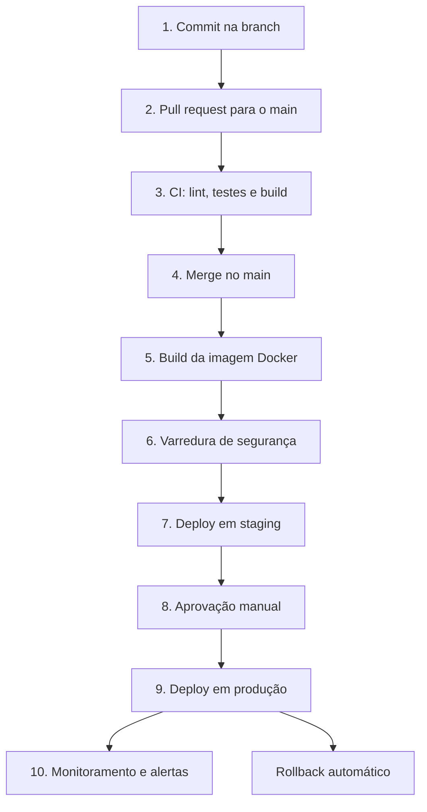

# Fluxo DevOps do PetHub

A imagem usada na apresentação é `docs/fluxo-devops.png`.

```mermaid
flowchart TD
    A[1. Commit na branch] --> B[2. Pull request para o main]
    B --> C[3. CI: lint, testes e build]
    C --> D[4. Merge no main]
    D --> E[5. Build da imagem Docker]
    E --> F[6. Varredura de segurança]
    F --> G[7. Deploy em staging]
    G --> H[8. Aprovação manual]
    H --> I[9. Deploy em produção]
    I --> J[10. Monitoramento e alertas]
    I --> K[Rollback automático]
```
