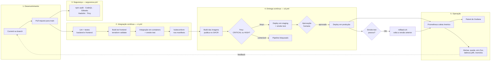

# Fluxo DevOps do PetHub

Diagrama de referência do pipeline completo. A imagem usada na apresentação é
`docs/fluxo-devops.png`, gerada a partir deste mesmo desenho.

```mermaid
flowchart LR
    subgraph DEV["1. Desenvolvimento"]
        A["Commit na branch"] --> B["Pull request para main"]
    end

    subgraph CI["2. Integração contínua — ci.yml"]
        C["Lint + testes<br/>backend e frontend"]
        D["Build do frontend<br/>terraform validate"]
        E["Integração em containers<br/>+ smoke test"]
        F["kubeconform<br/>nos manifests"]
        C --> D --> E --> F
    end

    subgraph SEC["3. Segurança — seguranca.yml"]
        G["npm audit · CodeQL · Gitleaks<br/>Hadolint · Trivy"]
    end

    subgraph CD["4. Entrega contínua — cd.yml"]
        H["Build das imagens<br/>publica no GHCR"]
        I{"Trivy:<br/>CRITICAL ou HIGH?"}
        J["Deploy em staging<br/>+ smoke test"]
        K{"Aprovação<br/>humana"}
        L["Deploy em produção"]
        H --> I
        I -->|"limpo"| J
        I -->|"vulnerável"| X["Pipeline bloqueado"]
        J --> K
        K -->|"aprovado"| L
    end

    subgraph OPS["5. Operação"]
        M["Prometheus coleta /metrics"]
        N["Painel do Grafana"]
        O["Alertas: queda, erro 5xx,<br/>latência p95, memória"]
        M --> N
        M --> O
    end

    B --> C
    B --> G
    F --> H
    L --> M
    L --> P{"Smoke test<br/>passou?"}
    P -->|"não"| Q["rollback.sh<br/>volta a versão anterior"]
    Q --> M
    O -.->|"feedback"| A
```
